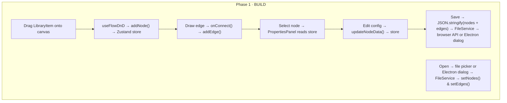
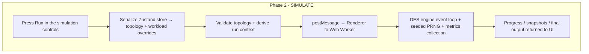
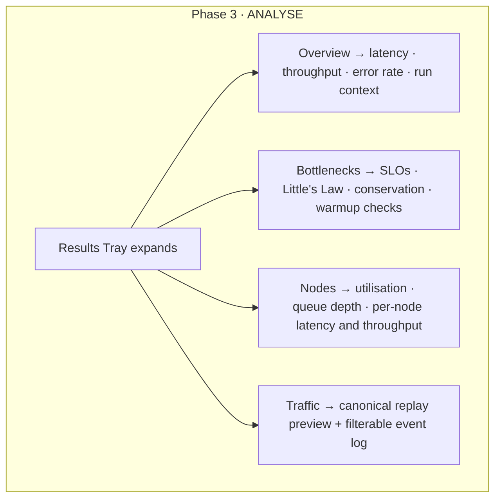
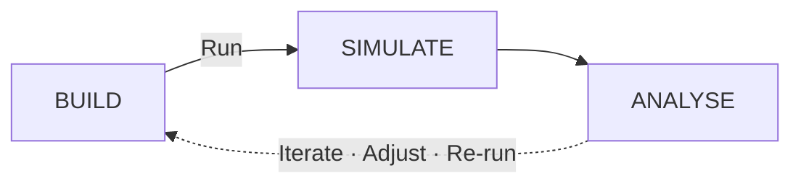

# NS System Design Simulator

> Draw a distributed system. Press Run. Watch it break — before you ship it.

A React + Vite application for simulating, stress-testing, and analysing high-level system designs using **Discrete Event Simulation (DES)**. It runs both as a browser SPA and inside an Electron desktop shell, powered by a G/G/c/K queueing engine under the hood.

---

## What It Does

You drag nodes onto a canvas (API servers, databases, caches, load balancers), connect them with edges, configure workload and runtime parameters, and then press **Run**. The engine simulates requests flowing through your architecture — tracking latency, queue depth, throughput, timeouts, rejections, and node utilization — without a real server in sight.

The current MVP surfaces run summaries, bottleneck checks, per-node metrics, and a canonical event replay log in the UI, and it also supports CLI and JSON-based output for scripted runs.

```
┌──────────┐         ┌──────────┐         ┌──────────┐
│  Users   │────────►│ Gateway  │────────►│   API    │
│  source  │  https  │  lb-l7   │  grpc   │  micro   │
│ 980 rps  │  1ms    │ ██░░ 40% │  0.5ms  │ ████ 85% │
└──────────┘         └──────────┘         └─────┬────┘
                                                 │  tcp  2ms
                                          ┌──────▼────┐
                                          │    DB     │
                                          │ postgres  │
                                          │ ██████ 97%│  ← bottleneck
                                          └───────────┘
```

---

## Three Phases

### 1 — BUILD

Drag nodes from the palette onto the canvas. Connect them. Configure each node's queue parameters (workers, capacity, service time distribution, timeout), resilience settings, edge behavior, and SLO targets. Adjust source selection, workload pattern, duration, warmup, timeout, and seed from the simulation controls before a run.

### 2 — SIMULATE

Press Run. The topology is serialized, validated, and executed inside a Web Worker. The discrete event loop processes events in time order, supports deterministic replay by seed, and exposes pause / resume / stop controls while the run is in progress.

### 3 — ANALYSE

When the simulation completes, a results tray expands with:

- **Overview** — latency percentiles, throughput, error rate, timeouts, and run context
- **Bottlenecks** — SLO breaches, Little's Law checks, conservation checks, and warmup adequacy
- **Nodes** — per-node throughput, queue depth, utilization, and latency
- **Traffic** — canonical replay preview plus a filterable event log

---

## System Lifecycle

This project is structured into three major phases:

- **Phase 1 · BUILD** (Implemented)
- **Phase 2 · SIMULATE** (Implemented in the current MVP)
- **Phase 3 · ANALYSE** (Implemented in the current MVP, with additional views still planned)

It follows an iterative workflow:

> **Build → Simulate → Analyse → Iterate**

---

## Phase 1 · BUILD

Users visually construct and configure system topology.



### Flow Summary

1. Drag a `LibraryItem` onto the canvas.
2. `useFlowDnD` calls `addNode()` → stored in Zustand.
3. Connect nodes → `addEdge()` updates store.
4. Select a node → `PropertiesPanel` reads state.
5. Edit config → `updateNodeData()` updates state.
6. Save → serialized JSON → FileService → browser file API or Electron dialog.
7. Open → browser file picker or Electron dialog → state restored.

---

## Phase 2 · SIMULATE

A deterministic simulation engine runs inside a Web Worker.



### Simulation Flow

- Serialize topology, edges, and selected workload/global overrides.
- Validate the topology before execution.
- Send the resulting `TopologyJSON` to a Web Worker.
- Run the discrete event simulation (DES) engine.
- Emit progress updates and snapshots, then return the final output plus replay data.

---

## Phase 3 · ANALYSE

Results are visualized and broken down for deeper insights.



### Analysis Capabilities

- Latency percentiles (P50–P99)
- Throughput & availability
- Per-node utilisation metrics
- Replayable canonical event stream
- SLO breach detection
- Warmup, conservation, and Little's Law checks

---

## Complete Lifecycle



---

## Tech Stack

| Layer             | Technology                                |
| ----------------- | ----------------------------------------- |
| App shell         | Browser SPA + Electron 38 desktop shell   |
| Build system      | Vite 7 + electron-vite 4                  |
| UI framework      | React 19 + TypeScript 5                   |
| Styling           | Tailwind CSS 3                            |
| Canvas            | React Flow 11                             |
| State management  | Zustand 5                                 |
| Validation        | Zod 4                                     |
| Testing           | Vitest 4                                  |
| Simulation engine | In-repo DES engine + Web Worker execution |

---

## Node Types

| Node          | Type          | Description                                  |
| ------------- | ------------- | -------------------------------------------- |
| API Server    | `computeNode` | Long-running process, configurable CPU/queue |
| Serverless Fn | `computeNode` | Event-driven, low baseline utilization       |
| Job Worker    | `computeNode` | Background task processing                   |
| Cron Job      | `computeNode` | Scheduled execution                          |
| Primary DB    | `serviceNode` | Relational SQL datastore                     |
| Redis Cache   | `serviceNode` | In-memory key/value store                    |
| Load Balancer | `serviceNode` | L7 request routing                           |
| VPC Region    | `vpcNode`     | Isolated network boundary / grouping         |

---

## Simulation Engine

The engine is a **Discrete Event Simulation loop** — no real clocks, no real servers, only a priority queue of timestamped events processed in order.

Each node is modelled as a **G/G/c/K queue**:

- `c` — concurrent workers
- `K` — max queue capacity (excess arrivals are rejected)
- Service time sampled from a configurable probability distribution (log-normal, exponential, Poisson, Weibull, etc.)

Core runtime pieces currently in the repo:

| Component              | Role                                                             |
| ---------------------- | ---------------------------------------------------------------- |
| Min-Heap               | O(log n) event priority queue                                    |
| BigInt time utilities  | Deterministic microsecond scheduling                             |
| Seeded PRNG            | Same seed = identical results                                    |
| G/G/c/K Node           | Per-node queue model with workers and capacity                   |
| Workload Generator     | Constant / Poisson / Spike / Diurnal / Bursty / Sawtooth traffic |
| Routing Table          | Weighted path resolution and fan-out handling                    |
| Topology Validator     | Zod-backed schema + structural validation                        |
| Metrics Collector      | Latency, throughput, error rate, SLO, and queueing checks        |
| Request Tracer         | Per-request span collection                                      |
| Canonical Event Stream | Replay-friendly lifecycle/event recording                        |
| Web Worker Runner      | Off-main-thread simulation execution                             |

Advanced fault modeling, broader resilience semantics, and richer post-run analysis are also documented in `ns-simulator-docs/` and are being expanded incrementally in the runtime.

---

## Submodule: `ns-simulator-docs`

The `ns-simulator-docs/` directory is a Git submodule containing the theory, specs, planning material, generated reference artifacts, and workflow assets that support the simulator:

```
ns-simulator-docs/
├── docs/
│   ├── SYSTEM_OVERVIEW.md              # End-to-end system reference
│   ├── theoretical-foundations.md      # Queueing theory, DEVS, reliability
│   └── 01-05-*.md                      # Core documentation series
├── schema/                             # Canonical TypeScript schema + schema docs
├── canonical-catalogue/                # 17 CSV reference files + catalogue README
├── planning/
│   ├── IMPLEMENTATION_PLAN.md          # 10-phase build plan
│   ├── TICKETS.md                      # 46 engineering tickets
│   └── analysis/                       # Planning / meeting analysis notes
├── design-decisions/                   # ADRs and issue writeups
├── specs/                              # Feature and semantics specifications
├── generated/                          # Generated topologies and sheet exports
├── skills/                             # Codex skills for docs/schema/scenario workflows
├── tools/                              # Helper scripts
├── stitch_simulation_output_analysis/  # UI reference captures
└── system-mind-map.md                  # High-level concept map
```

Notable additions in the current submodule checkout are `skills/`, `generated/`, `specs/`, `tools/`, and the expanded `design-decisions/` set.

To initialise the submodule after cloning:

```bash
git submodule update --init --recursive
```

---

## Getting Started

### Prerequisites

- Node.js 20+
- npm

### Install

```bash
npm install
```

### Development

```bash
npm run dev:web       # browser SPA
npm run dev:electron  # Electron desktop shell
```

### Type check

```bash
npm run typecheck
```

### Build

```bash
npm run build:web       # browser production bundle
npm run build:electron  # Electron production bundle
npm run build:all       # both targets, same path used in CI

# Electron installers
npm run build:electron:mac
npm run build:electron:win
npm run build:electron:linux
```

### Test

```bash
npm run test
```

### CLI

```bash
npm run simulate -- order-topology.json
npm run simulate -- order-topology.json --json
```

---

## Design Principles

- **Deterministic by default** — every simulation run is seeded; the same seed always produces identical output
- **No decorative animation** — every visual (colour change, edge pulse, queue bar) represents real simulation data
- **Mathematical transparency** — metrics show their formula on hover (e.g. `utilization = activeWorkers / maxWorkers`)
- **Desktop-first** — minimum 1280px viewport; no mobile layout compromise
- **Single source of truth** — canvas, inspector panel, and JSON topology viewer all read from and write to one Zustand store

---

## Accuracy Contract

To keep demos and analysis trustworthy, parameters are classified into four classes:

- **Invariant (hardcoded):** simulator mechanics and safety guards that should not vary per scenario.
- **Default + Override:** defaults are provided, but users can override them per node/edge.
- **User Parameter:** visible controls that must affect simulation behavior.
- **Not Simulated:** fields retained for UX/modeling completeness that do not currently affect runtime behavior.

### Invariants (hardcoded)

- Event ordering and tie-breaking (timestamp -> priority -> stable sequence)
- Core queue semantics (`fifo`/`lifo`/`priority`/`wfq`)
- Time-unit internals (microsecond scheduling)
- Safety clamps and bounds

### Default + Override (edge model)

Edges now use serializer defaults only as fallback and can be configured per edge:

- Protocol and mode
- Latency distribution (`mu`, `sigma`) and `pathType`
- Bandwidth
- Max concurrent requests
- Packet loss rate
- Edge error rate

### User Parameters (node model)

Visible node controls that currently influence runtime behavior:

- Queueing knobs (`workers`, `capacity`, `queueDiscipline`, `meanServiceMs`, `timeoutMs`)
- Throughput/load/queue hints
- `vCPU` and `RAM` (deterministic mapping to derived queue/perf behavior)
- `status` (healthy/degraded/critical performance/error impact)
- Service `errorRate` (node-level failure injection)
- Security `blockRate` and `droppedPackets` (arrival-time rejection/timeout behavior)

### Not Simulated

Fields that are not wired to runtime behavior are hidden from the default inspector UI.

---

## Implementation Status

| Area                                                    | Status  |
| ------------------------------------------------------- | ------- |
| Browser SPA target                                      | Done    |
| Electron desktop target                                 | Done    |
| React Flow canvas (nodes + edges)                       | Done    |
| Drag-and-drop node palette                              | Done    |
| Node types (Compute, Service, VPC)                      | Done    |
| Atomic design system (atoms → organisms)                | Done    |
| Zustand topology store                                  | Done    |
| Inspector panel                                         | Done    |
| File save / load via browser APIs and Electron dialogs  | Done    |
| Scenario controls (source/workload/global runtime)      | Done    |
| Topology serialization + validation                     | Done    |
| Simulation engine (DES loop)                            | Done    |
| Web Worker execution                                    | Done    |
| Results tray (overview / bottlenecks / nodes / traffic) | Done    |
| CLI simulation runner                                   | Done    |
| Advanced fault authoring UI                             | Partial |
| Advanced cost / failure analysis UI                     | Planned |

See `ns-simulator-docs/planning/TICKETS.md` for the full 46-ticket breakdown.

---

## Contributing

### Setup

```bash
git clone <repo-url>
cd ns-simulator
git submodule update --init --recursive   # pulls ns-simulator-docs
npm install
npm run dev:web
```

### Branch Naming

```
feature/<kebab-case-description>    # new functionality
fix/<kebab-case-description>        # bug fixes
```

Examples from this repo: `feature/add-ui-dependencies`, `feature/implement-vpc`, `feature/react-flow-canvas-setup`.

### Commit Messages

Imperative mood, sentence case, no period.

```
Add Tailwind CSS, ReactFlow, Zustand, and UI dependencies
Fix circuit breaker state not resetting on node recovery
Refactor VPC node to extract header and toolbar molecules
```

### Before Pushing

```bash
npm run typecheck    # tsc across both node + web tsconfigs
npm run lint         # eslint
npm run test         # vitest
npm run build:all    # browser + Electron production builds
npm run format       # prettier --write
```

The branch should stay green on both targets. `build:web`, `build:electron`, and `build:all` all run `typecheck` automatically.

### Pull Requests

- One concern per PR — don't bundle UI changes with engine work.
- Title: short, imperative, under 70 characters.
- PRs targeting the simulation engine require a note on determinism: confirm the change does not break seed reproducibility.
