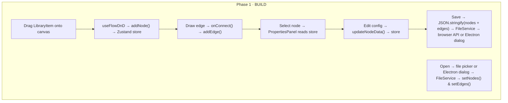
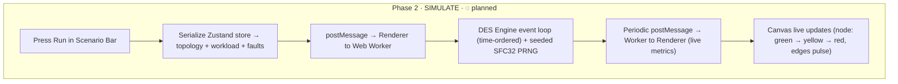
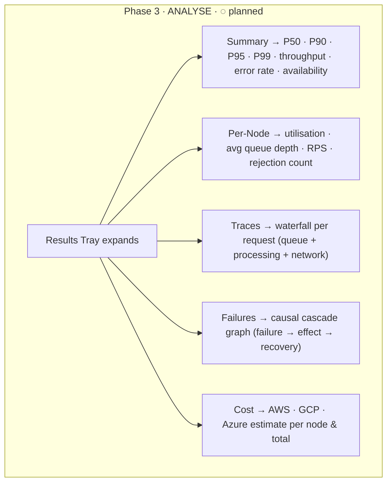
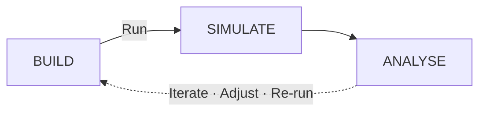

# NS System Design Simulator

> Draw a distributed system. Press Run. Watch it break — before you ship it.

A React + Vite application for simulating, stress-testing, and analysing high-level system designs using **Discrete Event Simulation (DES)**. It runs both as a browser SPA and inside an Electron desktop shell, powered by a G/G/c/K queueing engine under the hood.

---

## What It Does

You drag nodes onto a canvas (API servers, databases, caches, load balancers), connect them with edges, configure traffic and failure scenarios, and then press **Run**. The engine simulates thousands of requests flowing through your architecture — tracking latency, queue depth, throughput, and cascading failures — all without a real server in sight.

The result: P50/P95/P99 latency breakdowns, per-node utilization heatmaps, request waterfall traces, failure cascade graphs, and cost estimates — before you write a line of production code.

```
┌──────────┐         ┌──────────┐         ┌──────────┐
│  Users   │────────►│ Gateway  │────────►│   API    │
│  source  │  https  │  lb-l7   │  grpc   │  micro   │
│ 980 rps  │  1ms    │ ██░░ 40% │  0.5ms  │ ████ 85% │
└──────────┘         └──────────┘         └─────┬────┘
                                                 │  tcp  2ms
                                          ┌──────▼────┐
                                          │    DB     │
                                          │ postgres  │
                                          │ ██████ 97%│  ← bottleneck
                                          └───────────┘
```

---

## Three Phases

### 1 — BUILD

Drag nodes from the palette onto the canvas. Connect them. Configure each node's queue parameters (workers, capacity, service time distribution, timeout), resilience settings (circuit breaker, rate limiter, retry policy), and SLO targets. Set up traffic patterns and fault injections in the scenario bar.

### 2 — SIMULATE

Press Run. The engine runs in a Web Worker — a discrete event loop that processes millions of events in time order, sampling service times from probability distributions (log-normal, exponential, Poisson, etc.). The canvas updates live: nodes shift from green to yellow to red as they saturate; edges pulse with traffic load.

### 3 — ANALYSE

When the simulation completes, a results tray expands with:

- **Summary** — P50 / P90 / P95 / P99 latency, throughput, error rate, availability, Little's Law check
- **Per-Node** — utilization, avg queue depth, RPS, rejection count, P99 per node
- **Traces** — waterfall views of individual requests (like Chrome DevTools' Network tab)
- **Failures** — causal cascade graph when failure injection triggers
- **Cost** — per-node and total cloud cost estimate (AWS / GCP / Azure)

---

## System Lifecycle

This project is structured into three major phases:

- **Phase 1 · BUILD** (Implemented)
- **Phase 2 · SIMULATE** (Planned)
- **Phase 3 · ANALYSE** (Planned)

It follows an iterative workflow:

> **Build → Simulate → Analyse → Iterate**

---

## Phase 1 · BUILD

Users visually construct and configure system topology.



### Flow Summary

1. Drag a `LibraryItem` onto the canvas.
2. `useFlowDnD` calls `addNode()` → stored in Zustand.
3. Connect nodes → `addEdge()` updates store.
4. Select a node → `PropertiesPanel` reads state.
5. Edit config → `updateNodeData()` updates state.
6. Save → serialized JSON → FileService → browser file API or Electron dialog.
7. Open → browser file picker or Electron dialog → state restored.

---

## Phase 2 · SIMULATE · ◌ Planned

A deterministic simulation engine runs inside a Web Worker.



### Simulation Flow

- Serialize topology + workload + fault config.
- Send to Web Worker.
- Run discrete event simulation (DES).
- Emit periodic metric snapshots.
- Update UI in real-time.

---

## Phase 3 · ANALYSE · ◌ Planned

Results are visualized and broken down for deeper insights.



### Analysis Capabilities

- Latency percentiles (P50–P99)
- Throughput & availability
- Per-node utilisation metrics
- Request-level waterfall traces
- Failure cascade graphs
- Cloud cost estimation

---

## Complete Lifecycle



---

## Tech Stack

| Layer             | Technology                                           |
| ----------------- | ---------------------------------------------------- |
| App shell         | Browser SPA + Electron desktop shell                 |
| Build system      | Vite 7 + electron-vite 4                             |
| UI framework      | React 19 + TypeScript 5                              |
| Styling           | Tailwind CSS 3                                       |
| Canvas            | React Flow 11                                        |
| State management  | Zustand 5                                            |
| Icons             | Lucide React                                         |
| Simulation engine | Discrete Event Simulation (DES) — planned Web Worker |

---

## Node Types

| Node          | Type          | Description                                  |
| ------------- | ------------- | -------------------------------------------- |
| API Server    | `computeNode` | Long-running process, configurable CPU/queue |
| Serverless Fn | `computeNode` | Event-driven, low baseline utilization       |
| Job Worker    | `computeNode` | Background task processing                   |
| Cron Job      | `computeNode` | Scheduled execution                          |
| Primary DB    | `serviceNode` | Relational SQL datastore                     |
| Redis Cache   | `serviceNode` | In-memory key/value store                    |
| Load Balancer | `serviceNode` | L7 request routing                           |
| VPC Region    | `vpcNode`     | Isolated network boundary / grouping         |

---

## Simulation Engine (Planned)

The engine is a **Discrete Event Simulation loop** — no real clocks, no real servers, only a priority queue of timestamped events processed in order.

Each node is modelled as a **G/G/c/K queue**:

- `c` — concurrent workers
- `K` — max queue capacity (excess arrivals are rejected)
- Service time sampled from a configurable probability distribution (log-normal, exponential, Poisson, Weibull, etc.)

Key engine components being built (see `ns-simulator-docs/planning/`):

| Component           | Role                                                            |
| ------------------- | --------------------------------------------------------------- |
| Min-Heap            | O(log n) event priority queue                                   |
| SFC32 PRNG          | Deterministic random (same seed = identical results every time) |
| G/G/c/K Node        | Per-node queue model with workers and capacity                  |
| Workload Generator  | Constant / Poisson / Spike / Diurnal / Bursty traffic           |
| Network Edge        | Latency distributions, congestion, packet loss                  |
| Failure Injector    | Crash / latency spike / error rate faults at configurable times |
| Failure Propagation | Cascade walk through the dependency graph                       |
| Circuit Breaker     | CLOSED / OPEN / HALF_OPEN state machine                         |
| Metrics Collector   | Latency percentiles, throughput, error rate, Little's Law check |
| Request Tracer      | Per-request waterfall data                                      |
| Web Worker          | Runs engine off the main thread; streams snapshots to UI        |

---

## Submodule: `ns-simulator-docs`

The `ns-simulator-docs/` directory is a Git submodule containing all design documentation:

```
ns-simulator-docs/
├── docs/
│   ├── SYSTEM_OVERVIEW.md             # End-to-end system reference
│   ├── theoretical-foundations.md     # Queueing theory, DEVS, reliability
│   ├── 01-system-diagrams.md          # Nodes, edges, graph patterns
│   ├── 02-simulation-fundamentals.md  # Events, time, the event loop
│   ├── 03-data-structures-and-mechanics.md  # Min-heap, PRNG, G/G/c/K
│   ├── 04-distributed-systems-and-failures.md  # Network physics, failure modes
│   └── 05-devs-chaos-and-analysis.md  # DEVS formalism, chaos, output analysis
├── schema/
│   └── complete_simulator_schema.ts   # 2300+ line TypeScript type system
├── canonical-catalogue/               # 17 CSV reference files covering:
│   │                                  #   component taxonomy (110+ types)
│   │                                  #   failure modes & propagation rules
│   │                                  #   architectural patterns & anti-patterns
│   │                                  #   metrics & SLIs
│   │                                  #   pre-built scenarios
│   │                                  #   AWS / GCP / Azure provider mapping
│   └── README.md
├── planning/
│   ├── IMPLEMENTATION_PLAN.md         # 10-phase build plan
│   └── TICKETS.md                     # 46 engineering tickets with acceptance criteria
└── design-decisions/
    ├── adr-internal-modularity-over-plugin-system.md
    └── adr-no-custom-change-detection.md
```

To initialise the submodule after cloning:

```bash
git submodule update --init --recursive
```

---

## Getting Started

### Prerequisites

- Node.js 18+
- npm

### Install

```bash
npm install
```

### Development

```bash
npm run dev
```

### Type check

```bash
npm run typecheck
```

### Build

```bash
# macOS
npm run build:mac

# Windows
npm run build:win

# Linux
npm run build:linux
```

---

## Design Principles

- **Deterministic by default** — every simulation run is seeded; the same seed always produces identical output
- **No decorative animation** — every visual (colour change, edge pulse, queue bar) represents real simulation data
- **Mathematical transparency** — metrics show their formula on hover (e.g. `utilization = activeWorkers / maxWorkers`)
- **Desktop-first** — minimum 1280px viewport; no mobile layout compromise
- **Single source of truth** — canvas, inspector panel, and JSON topology viewer all read from and write to one Zustand store

---

## Accuracy Contract

To keep demos and analysis trustworthy, parameters are classified into four classes:

- **Invariant (hardcoded):** simulator mechanics and safety guards that should not vary per scenario.
- **Default + Override:** defaults are provided, but users can override them per node/edge.
- **User Parameter:** visible controls that must affect simulation behavior.
- **Not Simulated:** fields retained for UX/modeling completeness that do not currently affect runtime behavior.

### Invariants (hardcoded)

- Event ordering and tie-breaking (timestamp -> priority -> stable sequence)
- Core queue semantics (`fifo`/`lifo`/`priority`/`wfq`)
- Time-unit internals (microsecond scheduling)
- Safety clamps and bounds

### Default + Override (edge model)

Edges now use serializer defaults only as fallback and can be configured per edge:

- Protocol and mode
- Latency distribution (`mu`, `sigma`) and `pathType`
- Bandwidth
- Max concurrent requests
- Packet loss rate
- Edge error rate

### User Parameters (node model)

Visible node controls that currently influence runtime behavior:

- Queueing knobs (`workers`, `capacity`, `queueDiscipline`, `meanServiceMs`, `timeoutMs`)
- Throughput/load/queue hints
- `vCPU` and `RAM` (deterministic mapping to derived queue/perf behavior)
- `status` (healthy/degraded/critical performance/error impact)
- Service `errorRate` (node-level failure injection)
- Security `blockRate` and `droppedPackets` (arrival-time rejection/timeout behavior)

### Not Simulated

Fields that are not wired to runtime behavior are hidden from the default inspector UI.

---

## Implementation Status

| Area                                           | Status  |
| ---------------------------------------------- | ------- |
| React Flow canvas (nodes + edges)              | Done    |
| Drag-and-drop node palette                     | Done    |
| Node types (Compute, Service, VPC)             | Done    |
| Atomic design system (atoms → organisms)       | Done    |
| Zustand topology store                         | Done    |
| File save / load via browser APIs and Electron dialogs | Done    |
| Simulation engine (DES loop)                   | Planned |
| Inspector panel                                | Planned |
| Scenario bar (workload + faults + controls)    | Planned |
| Web Worker + live canvas coloring              | Planned |
| Results tray (summary, traces, failures, cost) | Planned |
| CLI (`simulator run / validate / compare`)     | Planned |

See `ns-simulator-docs/planning/TICKETS.md` for the full 46-ticket breakdown.

---

## Contributing

### Setup

```bash
git clone <repo-url>
cd ns-simulator
git submodule update --init --recursive   # pulls ns-simulator-docs
npm install
npm run dev
```

### Branch Naming

```
feature/<kebab-case-description>    # new functionality
fix/<kebab-case-description>        # bug fixes
```

Examples from this repo: `feature/add-ui-dependencies`, `feature/implement-vpc`, `feature/react-flow-canvas-setup`.

### Commit Messages

Imperative mood, sentence case, no period.

```
Add Tailwind CSS, ReactFlow, Zustand, and UI dependencies
Fix circuit breaker state not resetting on node recovery
Refactor VPC node to extract header and toolbar molecules
```

### Before Pushing

```bash
npm run typecheck    # tsc across both node + web tsconfigs
npm run lint         # eslint
npm run format       # prettier --write
```

All three must pass clean. The build runs `typecheck` automatically, so a failing type check will also break `npm run build`.

### Pull Requests

- One concern per PR — don't bundle UI changes with engine work.
- Title: short, imperative, under 70 characters.
- PRs targeting the simulation engine require a note on determinism: confirm the change does not break seed reproducibility.
